# 🎧 Customer Support Ticket Analysis

> **End-to-end exploratory data analysis of 8,469 customer support tickets** — uncovering trends in ticket volume, customer satisfaction, channel performance, and product-level support demand using Python.

---

## 📋 Table of Contents
- [Project Overview](#-project-overview)
- [Dataset](#-dataset)
- [Tools & Technologies](#-tools--technologies)
- [Key Business Questions](#-key-business-questions)
- [Analysis & Findings](#-analysis--findings)
- [Key Insights](#-key-insights)
- [Project Structure](#-project-structure)
- [How to Run](#-how-to-run)
- [Connect with Me](#-connect-with-me)

---

## 📌 Project Overview

Customer support data holds powerful signals about product health, customer sentiment, and operational efficiency. In this project, I performed a full exploratory data analysis (EDA) on a real-world customer support ticket dataset to answer critical business questions around:

- Which products generate the most support load?
- What are peak periods for ticket volume?
- How satisfied are customers across different channels and demographics?
- What is the distribution of ticket priorities and resolution status?

---

## 📦 Dataset

| Property | Detail |
|---|---|
| **Source** | [Kaggle – Customer Support Ticket Dataset](https://www.kaggle.com/datasets) |
| **Records** | 8,469 tickets |
| **Time Period** | 2020 – 2023 |
| **Key Columns** | Customer Age, Gender, Product Purchased, Ticket Type, Status, Priority, Channel, Satisfaction Rating |

---

## 🛠 Tools & Technologies


---

## ❓ Key Business Questions

1. How has ticket volume changed over time?
2. Which ticket channel is most used by customers?
3. How satisfied are customers overall, and does satisfaction vary by gender?
4. Which products generate the most support tickets?
5. What is the distribution of ticket types, priorities, and statuses?
6. Which age groups raise the most support tickets?

---

## 📊 Analysis & Findings

### 1. 📈 Ticket Volume Trends Over Time
Ticket volumes show seasonal patterns across 2020–2023. There are noticeable spikes around year-end periods, likely tied to product launches and holiday purchase surges.

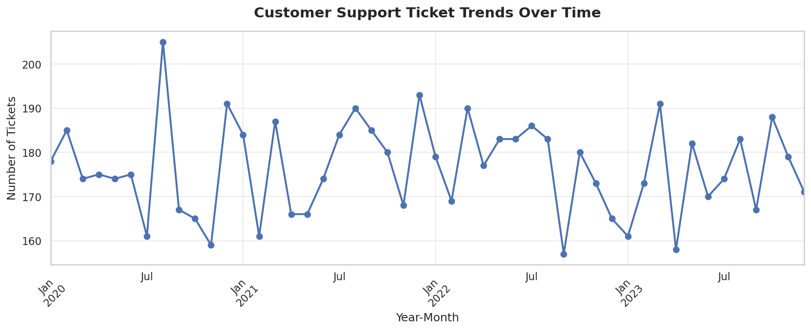

---

### 2. 😊 Customer Satisfaction Distribution
The majority of customers rate their experience **4 out of 5**, indicating generally positive support interactions, though a meaningful portion of 1–2 ratings highlights room for improvement.

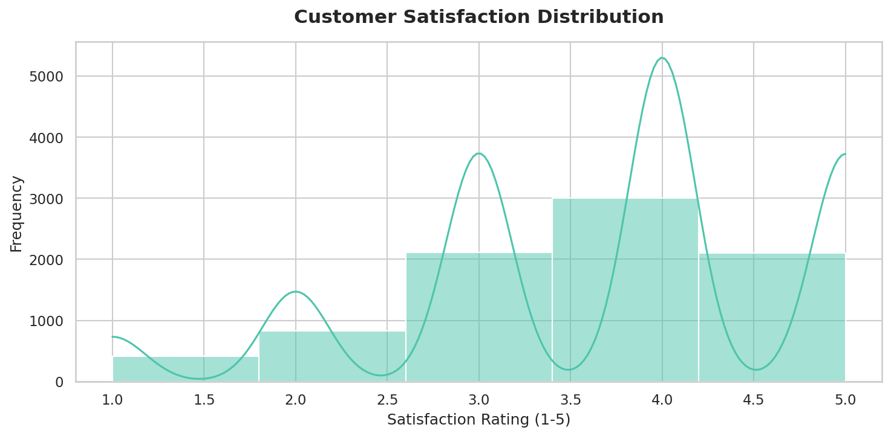

---

### 3. 📂 Ticket Status Breakdown
About **50.2% of tickets are resolved (Closed)**, with the remainder split between Open and Pending Customer Response — indicating a healthy but improvable resolution pipeline.

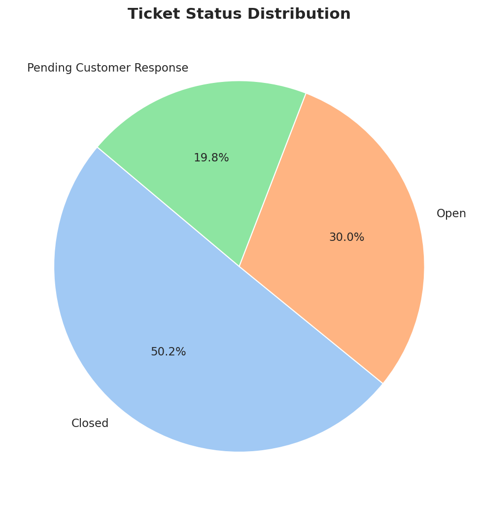

---

### 4. 👤 Customer Age Distribution
Support ticket raisers are spread across a wide age range. The **31–50 age group** forms the largest segment, suggesting this demographic is the most active product user base.

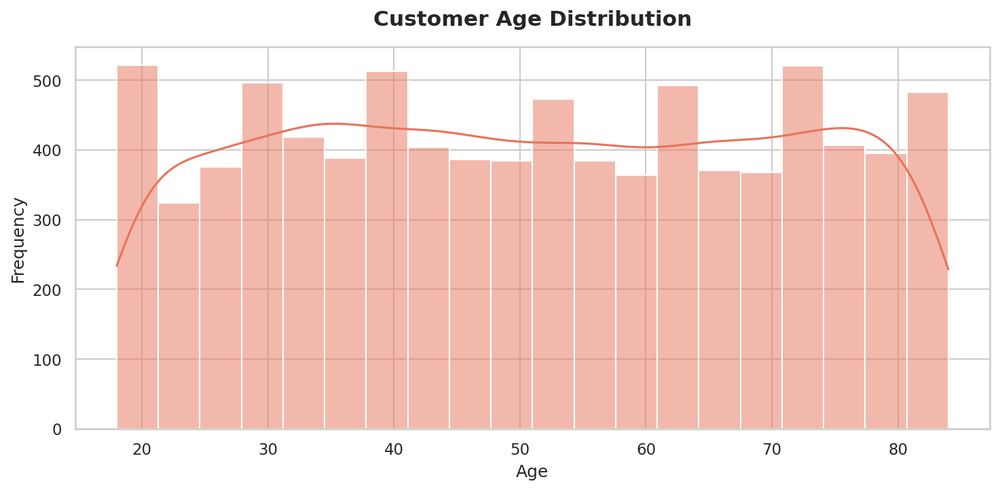

---

### 5. ⚧ Gender Distribution
The customer base is nearly equally split between Male (~45%) and Female (~45%), with ~10% identifying as Other.

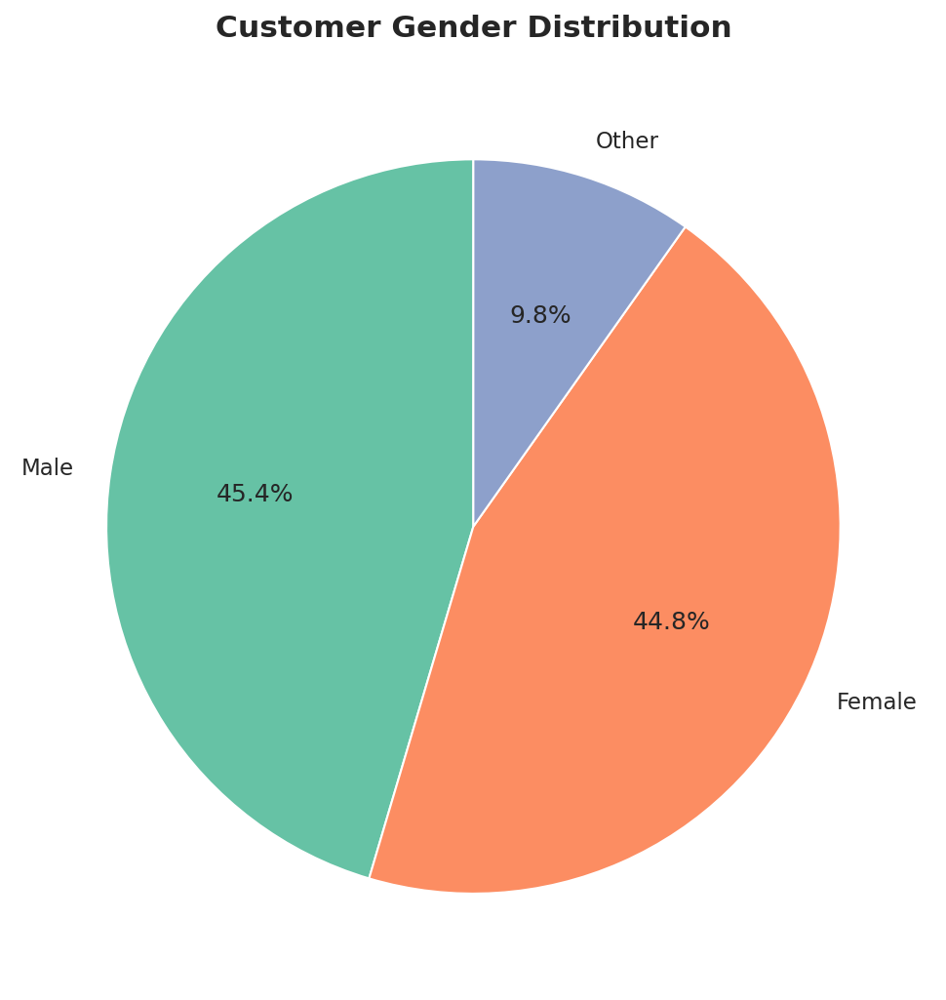

---

### 6. 📡 Ticket Channel Distribution
**Email is the most preferred support channel**, followed closely by Phone and Social Media. This suggests investment in email support automation could yield the highest ROI.

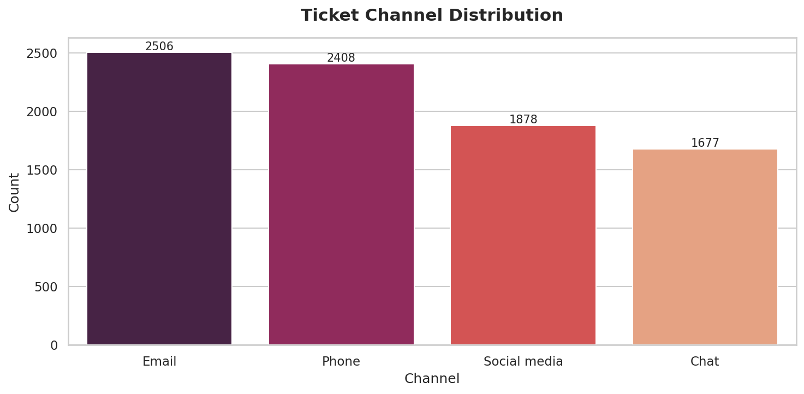

---

### 7. ⭐ Satisfaction by Gender
Average satisfaction scores are **consistent across all gender groups** (~3.6), suggesting no systemic bias in support quality based on customer gender.

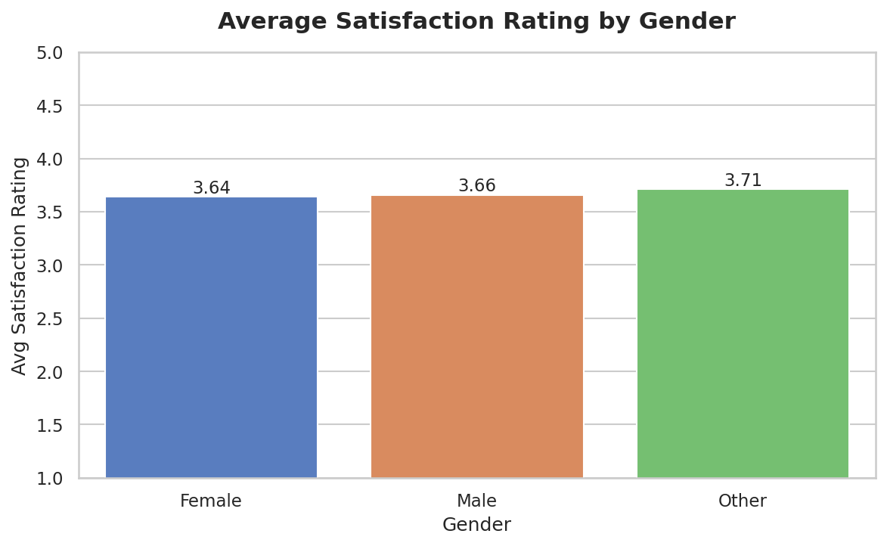

---

### 8. 🛒 Top Products by Support Tickets
Some products consistently generate higher support volumes — a key signal for the product and QA teams to prioritize improvements.

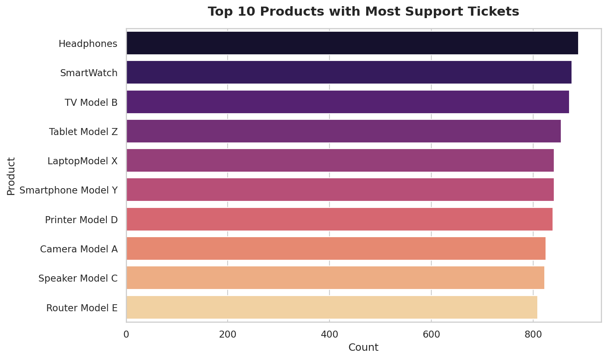

---

### 9. 🎫 Ticket Type Distribution
**Technical Issues dominate** (~45%) followed by Billing Inquiries and Product Inquiries, pointing to opportunities for better self-service documentation and FAQ resources.

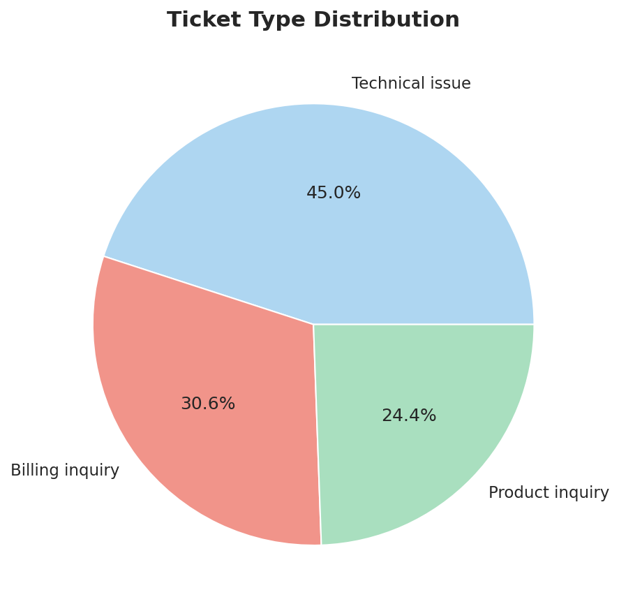

---

### 10. 🚦 Ticket Priority Levels
Medium priority tickets are most common. **Critical tickets** (~15%) represent urgent unresolved issues and deserve dedicated SLA tracking.

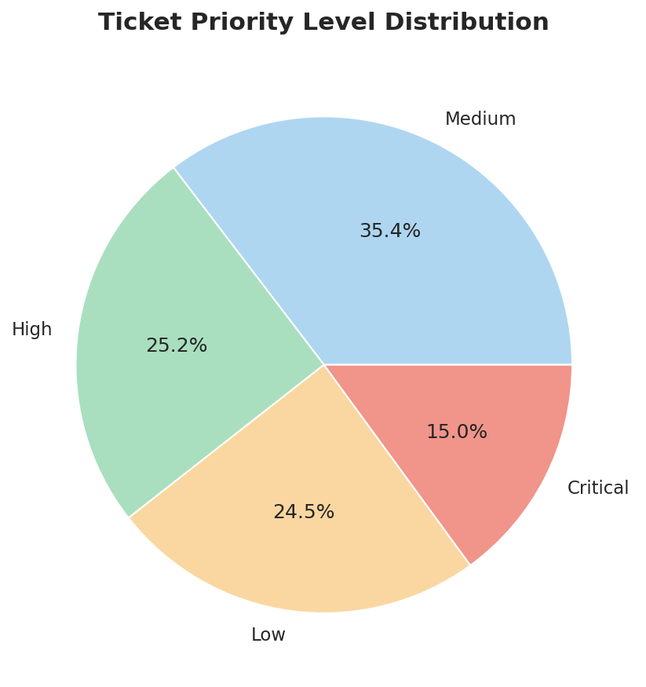

---

### 11. 🧑‍🤝‍🧑 Tickets by Age Group
Customers aged **31–50** raise the most tickets. Targeted self-service resources for this group could significantly reduce ticket load.

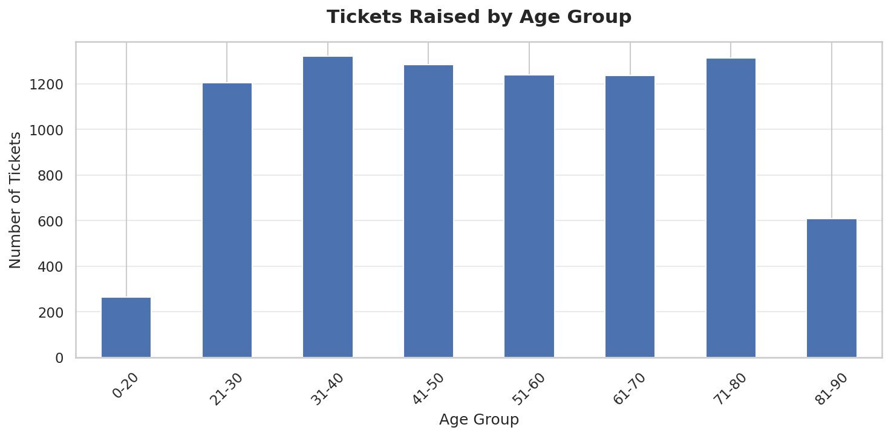

---

### 12. 🔥 Satisfaction Heatmap: Channel × Ticket Type
The heatmap reveals subtle satisfaction differences across channel and ticket type combinations — helping teams identify which channel-issue pairings need the most attention.

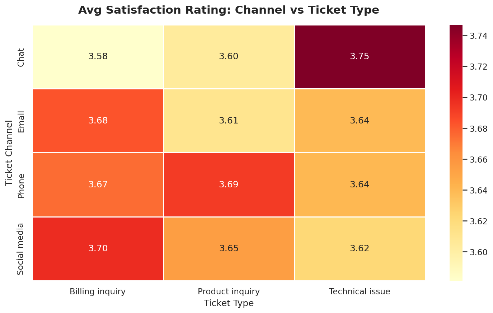

---

## 💡 Key Insights

| # | Insight | Business Implication |
|---|---|---|
| 1 | 50.2% of tickets are closed | Improve resolution workflows to push above 60% |
| 2 | Email is the #1 support channel | Invest in email automation & templates |
| 3 | Avg satisfaction is 3.66 / 5 | Target 4.0+ through faster resolution times |
| 4 | Technical issues = 45% of all tickets | Prioritize product documentation & tutorials |
| 5 | Ages 31–50 raise the most tickets | Build self-service portals targeting this group |
| 6 | Satisfaction is equal across genders | Support quality is unbiased — maintain this |
| 7 | Critical tickets are 15% of volume | Define SLA thresholds and escalation paths |

---

## 📁 Project Structure

```
customer-support-ticket-analysis/
│
├── README.md
├── customer-support-ticket-analysis.ipynb   ← Full analysis notebook
├── customer_support_tickets.csv             ← Dataset
└── images/
    ├── 01_ticket_trends.png
    ├── 02_satisfaction_dist.png
    ├── 03_ticket_status.png
    ├── 04_age_dist.png
    ├── 05_gender_dist.png
    ├── 06_ticket_channel.png
    ├── 07_satisfaction_gender.png
    ├── 08_top_products.png
    ├── 09_ticket_type.png
    ├── 10_priority_dist.png
    ├── 11_tickets_age_group.png
    └── 12_heatmap_satisfaction.png
```

---

## ▶️ How to Run

```bash
# 1. Clone this repo
git clone https://github.com/YOUR_USERNAME/customer-support-ticket-analysis.git
cd customer-support-ticket-analysis

# 2. Install dependencies
pip install pandas matplotlib seaborn numpy scikit-learn jupyter

# 3. Launch the notebook
jupyter notebook customer-support-ticket-analysis.ipynb
```

---

## 🔗 Connect with Me

- 📊 **Kaggle**: [kaggle.com/bappadityamahata](https://www.kaggle.com/bappadityamahata)
- 💼 **LinkedIn**: linkedin.com/in/bappaditya
mahata-d16b27
- 📧 **Email**: bappaditya2710@gmail.com

---

> ⭐ If you found this project useful, please consider giving it a star!
